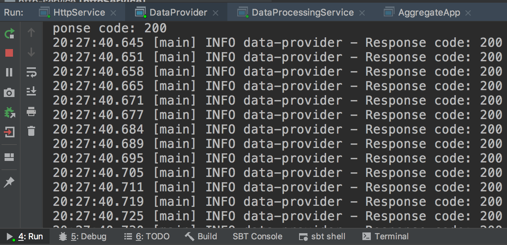

# Parking violations

[](https://nodesource.com/products/nsolid)

Parking violations pipeline is a streaming data analytics service that performs aggregations in real-time and saves aggregated data usild `spark streaming`.

### Data modeling
To understand data better we split the input into separate tables using several aggregations to produce metrics: `who, when, where, how much` and so on.
#### Facts
As an input we use data from [Kaggle](https://www.kaggle.com/new-york-city/nyc-parking-tickets#Parking_Violations_Issued_-_Fiscal_Year_2015.csv) containing registered parking violations with all sorts of information we can use.

#### Star Schema
Here is how the output tables look like

[](https://nodesource.com/products/nsolid)

##### Application architecture
[](https://nodesource.com/products/nsolid)

`DataProvider` is responsible for:
- parsing input files
- wrapping each line in the new model
- sending http request to balancer

Balancer is responsible for sending requests to `N` different ports, where `N`is the number of instances of `HttpService` we run.


`HttpService` is responsible for:
- receiving the http request
- deserializing it to make sure formatt matches
- wrapping it into Kafka message (`plateId` is used as a key)
- sending message to `Kafka` topic

`DataProcessor` is responsible for:
- reading data from `Kafka` topic, as a consumer it belongs to a consumer group and we can have as many instances as we like. As long as we set up the same consumer group we don't loose data
- deserializing the kafka message using `spark` functions
- streaming data with `spark-streaming` and performing aggregations on `Datasets`
- writing files in `parquet`

`Aggregator` implemented with scheduling mechanism based on `Quartz`. Running time is set with `CronScheduleBuilder`. 
`Aggregator` is responsible for:
- reading data saved with streaming `spark` job
- aggregating each tables
- writing output tables in `parquet`

`OutputQueryApp` located in the `Aggregator` module, it's an additional feature that produces answers on following questions:
1) Number of violation per month in 2015? 
2) Number of violations per time of day (when do most violations happen)?
3) Reason of violation per location?
4) Number violations issued per precinct by squad?
5) Most common reasons of all violation (Top-k)
6) Most common car color among all violations (Top-k)
7) Most common car make among all violations (Top-k)
8) Most common registration state among all violations (Top-k)
9) Locations with most violations (Top-K)

and saves all query results for questions in `/query_result/` folder in `parquet`.


##### Configuration details
This application is configured to work locally or on google cloud service, all `jars` and `input csv files` from Kagle should be located in the bucket on the cloud. All paths in every `application.conf` should include the bucket and FileSystem identifier according to the FileSystem used in the app.

##### What is installed
Cluster might be located on the `google cloud` or everything can be run locally if you have :
- `Hadoop`
- `Kafka`
- `Nginx` (may be setup without it)
- `spark`

Google cloud FileSystem connector is included in the `build.sbt` 
```scala
"com.google.cloud.bigdataoss" % "gcs-connector" % "hadoop2-1.9.17"
```
To make app work with cloud FileSystem we got this

```scala
val hdConf = streamingContext.sparkContext.hadoopConfiguration
  hdConf.set("fs.gs.impl", "com.google.cloud.hadoop.fs.gcs.GoogleHadoopFileSystem")
  hdConf.set("fs.AbstractFileSystem.gs.impl", "com.google.cloud.hadoop.fs.gcs.GoogleHadoopFS")
```

...which makes it not possible to run locally. So I left it commented in the code so it would be possible to clone the project and test the functionality of the whole app.

`Important` For local run we have to provide all the paths in `application.conf` that include the identifier suitable for FS used and uncomment the `hdConf` setting in the code.

#### build.sbt and all the apps

Application contains four independent services and one common library, containing all models and logic that is used in services:
```scala
lazy val common = (project in file("common")).settings(...)
lazy val dataProvider = (project in file("data-provider")).settings(...)
lazy val httpService = (project in file("http-service")).settings(...)
lazy val dataProcessor = (project in file("data-processor")).settings(...)
lazy val aggregationService = (project in file("aggregation-service")).settings(...)
```

The idea here is that services are `atomic`, this type of architecture allows to split services by people/departments and so on, and more - any functionality might be written in another language suitable for the particular service role.

Each `sbt` submodule is a project and has it's own configuration file.
#### httpService setup

In the `application.conf` we have
```sh
host = "localhost"
port = 8080
bootstrap-servers = "localhost:9092"
topic = "parking-violations"
```
`host` and `port` are a host and port of each instance of this app, so make sure it's the address `DataProvider` can reach.
`bootstrap-servers` and `topic` are for `Kafka`, make sure they are up and address is correct. They also appear in `DataProcessor` app configuration, and it should be the same.

#### dataProvider setup

In the `application.conf` we have
```sh
host = "localhost"
port = 8080
files = [
  "Parking_Violations_Issued_-_Fiscal_Year_2015.csv"
]
```

If you run locally without balancer the address should be the same as in `HttpService` configuration, or if you have a balancer - address of that balancer.
`files` is a List of files to be sent via http, the project has it's input file in resources for local run:
```scala
private[provider] def readFile(fileName: String): Iterator[String] = {
    scala.io.Source
      .fromFile(getClass.getResource(s"/$fileName").getPath)
      .getLines()
      .drop(1) //skip header
  }
```
If we are running on the cloud code should look like this
```scala
private[provider] def readFile(fileName: String): Iterator[String] = {
    scala.io.Source
      .fromFile(fileName).getPath)
      .getLines()
      .drop(1) //skip header
  }
```
Where file name is passed in `application.conf` for example like this
```sh
host = "localhost"
port = 8080
files = [
  "gs://besselfunction/nyc-parking-tickets/Parking_Violations_Issued_-_Fiscal_Year_2015.csv"
]
```
It a List because we can list the whole directory and it's quite handy for testing on big amount of data.

#### dataProcessor setup

In the `application.conf` we have
```sh
bootstrap-servers = "localhost:9092"
topic = "parking-violations"
group-id = "parking_violations_group"
base-path = "file:///Users/marina/parking-violations/"
year-location-table = "year-location-table"
location-reason-table = "location-reason-table"
state-table = "state-table"
year-month-table = "year-month-table"
violation-time-table = "violation-time-table"
car-color-table = "car-color-table"
car-make-table = "car-make-table"
precinct-squad-table = "precinct-squad-table"
```
`bootstrap-servers` and `topic` are the same as in `HttpService` configuration.
`group-id` is a `Kafka` concumer setting, make sure all instances of this app have the same group to avoid missing data.
`metric-table` are the tables to be produced, they will be located in `base-path` + "output/".
`base-path` should be setup according to FileSystem:
```sh
"file:///Users/marina/parking-violations/" --for local
"gs://besselfunction/demo/parking-violations/" -- for google cloud
"hdfs://besselfunction/demo/parking-violations/" --for hadoop
```
This `base-path` and table names also appear in the `AggregationService` app and they should be the same.

#### aggregationService setup

In the `application.conf` we have:

```sh
base-path = "file:///Users/marina/parking-violations/"
year-location-table = "year-location-table"
location-reason-table = "location-reason-table"
state-table = "state-table"
year-month-table = "year-month-table"
violation-time-table = "violation-time-table"
car-color-table = "car-color-table"
car-make-table = "car-make-table"
reason-table = "reason-table"
precinct-squad-table = "precinct-squad-table"
top-k-results = 5
```
`base-path` and table names should be the same as in the `dataProcessor` configuration.
`top-k-results` is a configurable parameter for our queries (Most common reasons of all violation (Top-k))

#### After setup
Now we have all configurations and ready to run. If you want to run right from intellij you need to open running config for the app and click on `Include dependencies with "Provided" scope` for each running object
[](https://nodesource.com/products/nsolid)

Now we can run: 
`HttpService` is up
[](https://nodesource.com/products/nsolid)

`DataProvider` is up
[](https://nodesource.com/products/nsolid)

`DataProcessingApp` is up.
We can open the topic `./kafka-console-consumer --bootstrap-server localhost:9092 --topic parking-violations --from-beginning` to check the writing
[](https://nodesource.com/products/nsolid)

`AggregationApp` is up
[](https://nodesource.com/products/nsolid)

Scheduling time is set in cron format:
```scala
CronScheduleBuilder.cronSchedule("0 0/1 * 1/1 * ? *")
```
Here it's every minute.

#### Example of query output (an example)
To answer the questions we can either write selects in `spark-shell` or run `OutputQueryApp`. The output of this service run will save data in `/query_result/` under `base-path`.

Number of violation per month in 2015?
```sh
+----+---------+-----+
|year|    month|count|
+----+---------+-----+
|2015|  January|59164|
|2015| February|31702|
|2015|    March|40592|
|2015|    April|39143|
|2015|      May|40359|
|2015|     June|41467|
|2015|     July| 9849|
|2015|   August| 8232|
|2015|September|  294|
+----+---------+-----+
```
Number of violations per time of day (when do most violations happen)?
```sh
+----+------+----------+
|hour|minute|violations|
+----+------+----------+
|   8|    36|       825|
+----+------+----------+
```
Reason of violation per location?
```sh
+--------+--------------------+-----+
|location|              reason|count|
+--------+--------------------+-----+
|    0018|      14-No Standing| 6007|
|    0019|38-Failure to Dis...| 4862|
|    0019|37-Expired Muni M...| 4247|
|    0014|69-Failure to Dis...| 4219|
|    0014|      14-No Standing| 3942|
|    0001|      14-No Standing| 3766|
|     114|21-No Parking (st...| 3573|
|    0017|      14-No Standing| 3222|
|     114|38-Failure to Dis...| 3186|
|    0019|      14-No Standing| 3176|
|    0019|21-No Parking (st...| 3135|
|    0018|69-Failure to Dis...| 3058|
|     109|38-Failure to Dis...| 2840|
|     112|38-Failure to Dis...| 2670|
|    0020|38-Failure to Dis...| 2668|
|    0061|38-Failure to Dis...| 2638|
|    0090|21-No Parking (st...| 2527|
|    0013|69-Failure to Dis...| 2369|
|    0070|38-Failure to Dis...| 2363|
|    0070|21-No Parking (st...| 2284|
+--------+--------------------+-----+
```
Number violations issued per precinct by squad?
```sh
+--------+-----+-----+
|precinct|squad|count|
+--------+-----+-----+
|       0| 0000|13373|
|       0|    0| 5307|
|      14|    M| 2757|
|       1|    C| 2654|
|      18|    A| 2543|
|       1|    E| 2541|
|       1|    J| 2061|
|      18|    C| 2046|
|       1|    H| 2028|
|      19|    O| 2007|
|      19|    H| 1975|
|      14|    L| 1743|
|     112|    K| 1695|
|      19|    E| 1677|
|      14|    J| 1665|
|     104|    K| 1646|
|       1|    D| 1617|
|      13|    A| 1614|
|      19|    R| 1602|
|      14|    E| 1582|
+--------+-----+-----+
```
Most common reasons of all violation (Top-k)
```sh
+--------------------+-----+
|         description|count|
+--------------------+-----+
|38-Failure to Dis...|74996|
|21-No Parking (st...|69936|
|      14-No Standing|48700|
|37-Expired Muni M...|40057|
|20A-No Parking (N...|24987|
+--------------------+-----+
```
Most common car color among all violations (Top-k)
```sh
+---------+------+
|car_color| count|
+---------+------+
|    WHITE|150281|
|    BLACK| 93049|
|     GRAY| 70151|
|     BLUE| 40816|
|      RED| 29170|
+---------+------+
```
Most common car make among all violations (Top-k)
```sh
+--------+-----+
|car_make|count|
+--------+-----+
|   TOYOT| 3624|
|    FORD| 3002|
|   HONDA| 2420|
|   CHEVR| 2205|
|   NISSA| 1933|
+--------+-----+
```
Most common registration state among all violations (Top-k)
```sh
+-----+------+
|state| count|
+-----+------+
|   NY|390048|
|   NJ| 46686|
|   PA| 12840|
|   CT|  6992|
|   FL|  5700|
+-----+------+
```
Locations with most violations (Top-K)
```sh
+--------+-----+
|location|count|
+--------+-----+
|    0019|29190|
|    0018|20551|
|    0014|19798|
|     114|15835|
|    0001|15799|
+--------+-----+
```

